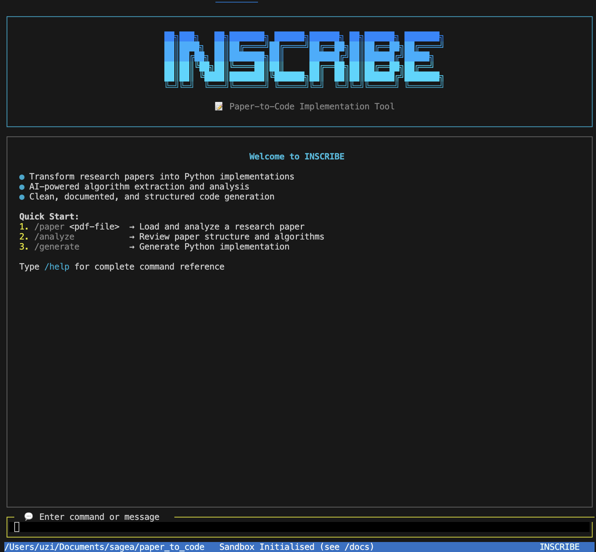

# INSCRIBE

<div align="center">




[](https://badge.fury.io/js/%40inscribe%2Fcli)
[](https://opensource.org/licenses/MIT)
[](https://nodejs.org/)
[](https://ollama.com/)
[](https://huggingface.co/comethrusws)

_Transform research papers into working code with SAGE_

[🚀 Quick Start](#quick-start) •
[📚 Documentation](#documentation) •
[✨ Features](#features) •
[🛠️ Installation](#installation) •
[🤝 Contributing](#contributing) •
[🔬 Examples](#examples)

</div>

---

## 🎯 Overview

**INSCRIBE** is an intelligent paper-to-code implementation tool that transforms research papers into working code implementations. Powered by SAGE AI models through Ollama, it analyzes academic papers and generates comprehensive, documented, and testable implementations of the algorithms and architectures described in research.

### Why INSCRIBE?

- **🔬 Research-to-Code**: Bridge the gap between academic papers and practical implementations
- **🧠 AI-Powered**: Leverage advanced language models for intelligent code generation
- **🏗️ Production Ready**: Generate clean, documented, and testable code
- **⚡ Fast**: Streamlined workflow from paper to working implementation
- **🎯 Accurate**: High-fidelity implementations that match paper specifications

## 🚀 Quick Start

```bash
# Install INSCRIBE globally
npm install -g @sagea-llc/inscribe-cli

# Generate code from a research paper
inscribe --paper "./attention_paper.pdf" --language python

# Start interactive mode
inscribe
```

## 📚 Documentation

Comprehensive documentation is available in the [`/docs`](./docs) folder:

### 👥 For Users

- **[📖 User Guide](./docs/user-guide.md)** - Complete guide to using INSCRIBE
- **[🛠️ Installation Guide](./docs/installation.md)** - Step-by-step installation instructions
- **[⌨️ CLI Reference](./docs/cli-reference.md)** - Command-line interface documentation

### 👨‍💻 For Developers

- **[🏗️ Architecture Guide](./docs/architecture.md)** - System architecture and design patterns
- **[🤝 Contributing Guide](./CONTRIBUTING.md)** - How to contribute to INSCRIBE

### 📝 Issue Templates

When creating issues, please use our templates in [`.github/issues/`](./.github/issues/):

- **Bug Reports**: Follow the bug report template
- **Feature Requests**: Use our enhancement template format
- **Documentation**: Improvements to guides and references

## ✨ Features

### 🔍 **Paper Analysis**

- **PDF Processing**: Extract and analyze text from research papers
- **Structure Detection**: Identify sections, algorithms, and methodologies
- **Mathematical Formula Parsing**: Extract and convert equations to code
- **Algorithm Classification**: Automatically categorize implementation approaches
- **Confidence Scoring**: Quality assessment for generated implementations

### 💻 **Code Generation**

- **Multi-Language Support**: Python (current), JavaScript, Java, C++ (planned)
- **Framework Integration**: PyTorch, TensorFlow, NumPy, Scikit-learn
- **Clean Architecture**: Modular, documented, and maintainable code
- **Test Generation**: Comprehensive unit tests and examples
- **Type Safety**: Type hints and validation for robust implementations

### 🎨 **User Experience**

- **Interactive CLI**: Beautiful terminal interface with progress tracking
- **Batch Processing**: Handle multiple papers simultaneously
- **Configuration System**: Customizable preferences and templates
- **Real-time Feedback**: Live progress updates and error handling
- **Output Customization**: Flexible code formatting and organization

### 🤖 **AI Integration**

- **SAGE Models**: Specialized reasoning models for code generation
- **Context Awareness**: Understand paper context for accurate implementations
- **Iterative Refinement**: Improve code quality through multiple passes
- **Error Detection**: Identify and fix common implementation issues

## Prerequisites

> [!NOTE] > **Automatic Installation**: INSCRIBE automatically installs Ollama and PDF processing tools (pdftotext/poppler) during setup. Manual installation is only needed if automatic installation fails.

### Manual Installation (if needed)

**Install Ollama:**

**macOS/Linux:**

```bash
curl -fsSL https://ollama.com/install.sh | sh
```

**Windows:**
Download and install from [ollama.com/download](https://ollama.com/download)

**Install PDF Processing Tools (pdftotext/poppler):**

**macOS:**

```bash
brew install poppler
```

**Ubuntu/Debian:**

```bash
sudo apt-get install poppler-utils
```

**CentOS/RHEL:**

```bash
sudo yum install poppler-utils
```

**Windows:**
Download from [poppler for Windows](https://blog.alivate.com.au/poppler-windows/) or use Chocolatey:

```bash
choco install poppler
```

## Installation

### Global Installation (Recommended)

```bash
npm install -g @inscribe/cli
```

### Local Installation

```bash
git clone https://github.com/sagea-ai/inscribe.git
cd inscribe
npm install
```

The installation process will automatically:

1. Check for Ollama installation and install if needed
2. Check for PDF processing tools (pdftotext/poppler) and install if needed
3. Pull the default SAGE model (`comethrusws/sage-reasoning:3b`)
4. Set up the CLI environment with all dependencies

## Usage

### Start the CLI

```bash
inscribe
```

### Basic Interaction

Once launched, you can:

- Process PDF research papers using `/paper` command
- Analyze paper structure and algorithms using `/analyze`
- Generate Python implementations using `/generate`
- Use other commands for file operations and utilities

### Example Session

```
╭────────────────────────────────────────────────────────────────╮
│ Use /paper <pdf-file> to analyze a research paper              │
│ Use /analyze to examine paper structure and algorithms         │
│ Use /generate to create Python implementations                 │
│ /help for more information and commands.                       │
╰────────────────────────────────────────────────────────────────╯

> /paper ./research/transformer_paper.pdf
> /analyze
> /generate
```

## Commands

| Command           | Description                    | Example               |
| ----------------- | ------------------------------ | --------------------- |
| `/paper <pdf>`    | Analyze a research paper       | `/paper ./paper.pdf`  |
| `/analyze`        | Show detailed paper analysis   | `/analyze`            |
| `/generate`       | Generate Python implementation | `/generate`           |
| `/help`           | Display help message           | `/help`               |
| `/about`          | Show version information       | `/about`              |
| `/clear`          | Clear the screen               | `/clear`              |
| `/edit <file>`    | Load a file into context       | `/edit src/app.js`    |
| `/run <command>`  | Execute a shell command        | `/run python test.py` |
| `exit` or `/quit` | Exit the application           | `exit`                |

## Keyboard Shortcuts

| Shortcut                | Action                   |
| ----------------------- | ------------------------ |
| `Ctrl+C`, `q`, `Escape` | Quit application         |
| `Ctrl+L`                | Clear the screen         |
| `↑` / `↓`               | Navigate command history |
| `Enter`                 | Send message             |

## AI Models

INSCRIBE leverages SAGE reasoning models for paper analysis and code generation:

### Available Models

| Model        | Parameters | Use Case                                  | Performance |
| ------------ | ---------- | ----------------------------------------- | ----------- |
| **SAGE 3B**  | 3 Billion  | General coding assistance, fast responses | Fast        |
| **SAGE 8B**  | 8 Billion  | Complex reasoning, detailed explanations  | Balanced    |
| **SAGE 14B** | 14 Billion | Advanced problem solving, research tasks  | Precise     |

### Default Model

The CLI uses `comethrusws/sage-reasoning:3b` by default, which provides an excellent balance of speed and capability for most coding tasks.

> [!TIP]
> Future versions will allow model switching directly from the CLI interface.

## Project Structure

```
inscribe/
├── bin/
│   └── cli.js              # CLI entry point
├── src/
│   ├── app.js              # Main application logic
│   ├── commands/
│   │   └── handler.js      # Command handling
│   ├── paper/
│   │   ├── parser.js       # PDF text extraction
│   │   └── analyzer.js     # Paper structure analysis
│   ├── generator/
│   │   └── codeGenerator.js # Python code generation
│   ├── ollama/
│   │   └── client.js       # AI model integration
│   └── ui/
│       └── logo.js         # ASCII logo rendering
├── scripts/
│   └── install.js          # Post-install setup
├── images/
│   ├── inscribe-logo.png   # Project logo
│   └── inscribe.png        # CLI UI preview
└── package.json
```

## Development

### Local Development Setup

```bash
# Clone the repository
git clone https://github.com/sagea-ai/inscribe.git
cd inscribe

# Install dependencies
npm install

# Run in development mode
node bin/cli.js
```

### Requirements

- Node.js >= 16.0.0
- Dependencies auto-installed during setup:
  - Ollama and SAGE model
  - PDF processing tools (pdftotext/poppler)

## 🤝 Contributing

We welcome contributions from developers, researchers, and users! INSCRIBE is an open-source project that thrives on community involvement.

### 📋 Before Contributing

**IMPORTANT**: Please read our [Contributing Guidelines](./CONTRIBUTING.md) before making any contributions. All contributions must follow our standards:

1. **📝 Issue Templates**: Use our issue templates in [`.github/issues/`](./.github/issues/) - issues without templates will be closed
2. **🧪 Testing**: All code changes must include appropriate tests
3. **📚 Documentation**: Update relevant documentation for user-facing changes
4. **🎨 Code Style**: Follow our coding standards and style guide
5. **🔍 Review Process**: All PRs require review and approval

### 🚀 Quick Contribution Guide

```bash
# 1. Fork and clone the repository
git clone https://github.com/YOUR_USERNAME/paper_to_code.git
cd paper_to_code

# 2. Install dependencies
npm install

# 3. Run tests
npm test

# 4. Create a feature branch
git checkout -b feature/your-feature-name

# 5. Make changes and commit
git commit -m "feat: add your feature description"

# 6. Push and create PR
git push origin feature/your-feature-name
```

### 🎯 Areas We Need Help

- 🐛 **Bug Fixes**: Help us identify and fix issues
- 📚 **Documentation**: Improve guides, examples, and API docs
- 🧪 **Testing**: Add comprehensive test coverage
- ✨ **Features**: Implement planned enhancements
- 🌐 **Multi-language Support**: Add support for more programming languages
- 🎨 **UI/UX**: Improve user interface and experience

### 📞 Getting Help

- 💬 **GitHub Discussions**: Ask questions and get community help
- 🐛 **Issues**: Report bugs using our issue templates
- 📧 **Email**: Contact maintainers for complex topics
- 📖 **Documentation**: Check our comprehensive docs in [`/docs`](./docs)

## License

This project is licensed under the MIT License - see the [LICENSE](LICENSE) file for details.

## 🔬 Examples

### Basic Usage

```bash
# Generate Python implementation from a paper
inscribe --paper "transformer_paper.pdf" --language python

# Generate with tests and documentation
inscribe --paper "paper.pdf" --include-tests --include-docs --verbose

# Batch process multiple papers
inscribe --batch "./papers/*.pdf" --output "./implementations/"
```

### Generated Code Example

```python
# Generated from "Attention Is All You Need" paper
class MultiHeadAttention:
    """
    Multi-Head Attention mechanism from "Attention Is All You Need"

    Paper: https://arxiv.org/pdf/1706.03762.pdf
    Authors: Vaswani et al.
    """

    def __init__(self, d_model: int, num_heads: int):
        self.d_model = d_model
        self.num_heads = num_heads
        self.d_k = d_model // num_heads

    def forward(self, query: torch.Tensor, key: torch.Tensor, value: torch.Tensor):
        # Implementation details...
        return attention_output
```

## 🗺️ Roadmap

### 🚀 Current (v1.0)

- [x] PDF paper processing and analysis
- [x] Python code generation with PyTorch/TensorFlow
- [x] Interactive CLI interface
- [x] Basic error handling and validation

### 🔮 Near Future (v1.1-1.2)

- [ ] **Multi-format Support**: arXiv URLs, web papers, Word documents
- [ ] **Enhanced Analysis**: Mathematical formula extraction, algorithm classification
- [ ] **Interactive Refinement**: Real-time code improvement and explanation
- [ ] **Configuration System**: User preferences and customizable templates

### 🌟 Long Term (v2.0+)

- [ ] **Multi-language Support**: JavaScript, Java, C++, Go, Rust
- [ ] **Project Management**: Track multiple implementations and versions
- [ ] **Web Interface**: Browser-based paper analysis and code generation
- [ ] **API Integration**: REST API for programmatic access
- [ ] **Collaboration Features**: Team workflows and shared implementations

### 📊 Priority Issues

Check our [Issue Templates](./.github/issues/) for detailed enhancement proposals:

- **[Enhanced Paper Analysis](./.github/issues/enhanced-paper-analysis.md)** - Better algorithm extraction and mathematical parsing
- **[Multi-format Support](./.github/issues/multi-format-paper-support.md)** - Support for arXiv, web papers, and more formats
- **[Interactive Refinement](./.github/issues/interactive-code-refinement.md)** - Real-time code improvement capabilities

---

<div align="center">

[](https://sagea.space)

</div>
